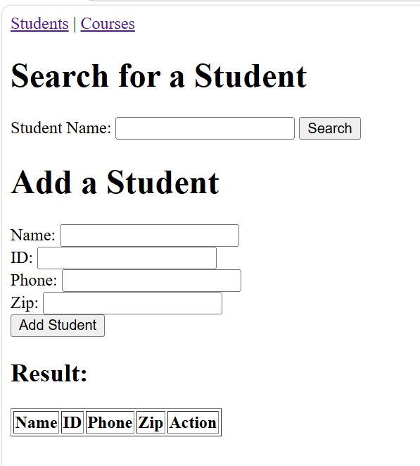
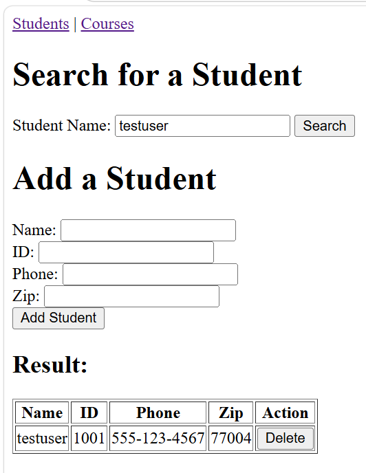
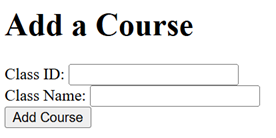
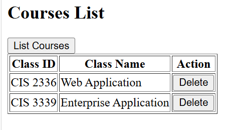
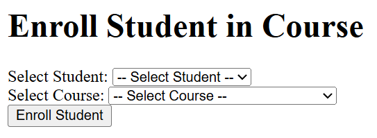
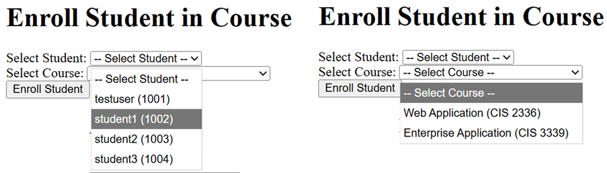
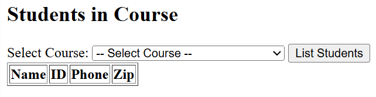
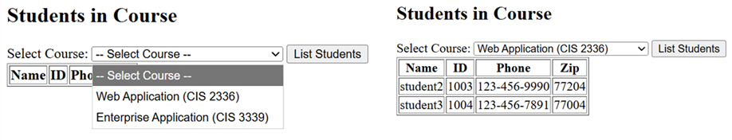

[](https://classroom.github.com/a/g6HhT1TC)
[](https://classroom.github.com/open-in-codespaces?assignment_repo_id=24303849)
# CIS 2336 Final Exam: Full-Stack Student Management System

## Exam Overview
In this exam, you will build a full-stack web application that manages students and course enrollments. The project consists of a Node.js backend API and an HTML/JavaScript frontend.

## Prerequisites
- Node.js installed on your system
- A modern web browser
- Basic knowledge of JavaScript, Node.js, Express, and HTML/CSS

## AI Tools
You are encouraged to use **AI tools** for this exam, such as:
- Visual Studio Code + Copilot
- Antigravity

---

## Part 1: Running the Template Code

### Step 1: Set Up the Backend
1. Navigate to the `./backend/` directory:
   ```bash
   cd ./backend
   ```

2. Install dependencies:
   ```bash
   npm install
   ```
   or 
   ```bash
   npm install express cors
   ```
   This will install Express and CORS packages required by the server.

3. Start the backend server:
   ```bash
   node server.js
   ```
   You should see the message: `Server is running on http://localhost:3000`

4. Leave the server running. Do NOT close this terminal.

### Step 2: Run the Frontend
1. Navigate to the `./frontend/` directory.

2. Open `index.html` in your web browser.

3. You should see the Students page with forms to search and add students.

<br>
<div align="center">
  
</div>
<br>

4. Test the frontend/backend by searching student `testuser`, and you should have the following output:
<br>
<div align="center">
  
</div>
<br>

5. Check the `students.json` in the `./backend` and all students' should have been saved in a JSON format.

---

## Part 2: What You Need to Implement

The template code provides basic structure but is incomplete. Your task is to implement the following features:

### **Feature 1: Student Management (on index.html)**
Already partially implemented. You need to ensure these work:
- ✅ **Search Student**: Find a student by name
- ✅ **Add Student**: Add a new student with name, ID, phone, and zip
- ✅ **Delete Student**: Remove a student from the system

### **Feature 2: Course Management (Backend Enhancements)**

#### Function 1: Add a Course
1. In the `courses` page, add a form to add a class by giving a Class ID and Class Name.
2. Modify the backend code to add an *endpoint* and JSON file to handle *add class* request.
3. Here is an example of *add class* form.

<br>
<div align="center">
  
</div>
<br>

#### Function 2: Get All Courses
1. In the `courses` page, add a component to list all classes as follows:

<br>
<div align="center">
  
</div>
<br>

2. Each listed class can be *deleted* by clicking the `delete` button.
3. Modify the backend code to add an *endpoint* to handle *list class* request.

#### Function 3: Add Enrollment
1. In the `courses` page, add a component to add erollment follows:

<br>
<div align="center">
  
</div>
<br>

2. The student and classes can be selected from the dropdown list as follows:

<br>
<div align="center">
  
</div>
<br>

#### Function 4: Get Enrollments for a Course
1. In the `courses` page, add a component to list all students from a selected class as follows:

<br>
<div align="center">
  
</div>
<br>

2. Once the course is being selected, click the `List Students` button, the result is showing as follows:

<br>
<div align="center">
  
</div>
<br>

### **Data Integrity**
- Please make sure the data integrity between the record of students, courses, and enrollments when adding or deleting a student or a course.

#### Function 5: Add style to the frontend (**optional: earn bonus points**)

- You can ask AI to add style and build a more `user friendly` frontend.

## Part 3: Testing Your Implementation

### Step 1: Test Student Management
1. Add a student: Name: "John", ID: 1001, Phone: 555-1234, Zip: 77001
2. Search for "John" - should find the student
3. Add another student: Name: "Jane", ID: 1002, Phone: 555-5678, Zip: 77002
4. Delete John - should remove from system

### Step 2: Test Course Management
1. Add a course: ID: "CIS 2336", Name: "Web Application"
2. Add another course: ID: "CIS 4365", Name: "Database Systems"
4. Click "List Courses" - should see both courses
5. Delete one course - enrollments should be removed too

### Step 3: Test Enrollments
1. Make sure you have at least 2 students and 2 courses
2. In "Enroll Student in Course", select a student and course, click Enroll
3. Select another student and enroll them
4. Click "List Students" for a course - should see enrolled students
5. Delete a student - their enrollments should be removed

### Step 4: Verify Data Persistence
1. Stop the server (Ctrl+C)
2. Restart the server: `node server.js`
3. Refresh the browser - data should still be there

---

## Part 4: Deliverables Checklist

Make sure your submission includes:

- [ ] **Backend (`full-stack/backend/`)**
  - [ ] `server.js` with all 6 API endpoints implemented
  - [ ] `package.json` with Express and CORS dependencies
  - [ ] `students.json`, and other `json` files created for saving data

- [ ] **Frontend (`full-stack/frontend/`)**
  - [ ] `index.html` - Students management page
  - [ ] `courses.html` - Courses and enrollments page
  - [ ] `script.js` with all JavaScript functions implemented

- [ ] **Functionality**
  - [ ] Can add/search/delete students
  - [ ] Can add/list/delete courses
  - [ ] Can enroll students in courses
  - [ ] Can view students in a course
  - [ ] Data persists after server restart
  - [ ] All error cases handled gracefully
  - [ ] No console errors

---

## Part 5: Submission Instructions

1. Complete all implementations
2. Test all features thoroughly
3. Ensure no console errors or warnings
4. Clean up any debug code
5. Push all changes to the repository (**Don't include `node_modules` folder in the repository, remove it before committing the change and push**)
   - Working backend code
   - Working frontend code

---

## Part 6: Tips and Troubleshooting

### Issue: "Cannot find module 'express'"
**Solution**: Run `npm install` in the backend directory

### Issue: "CORS error" when frontend tries to reach backend
**Solution**: Make sure backend is running on port 3000 and CORS is enabled in server.js

### Issue: Frontend shows blank page
**Solution**: 
- Check browser console for errors (F12)

## Suggestions:
1. **Use AI**. You don't need to write a single line of code if you are working with AI tools.
2. Add style to the frontend is optional, however, you'll earn bonus points if you do.
---

## Good Luck! 🎓

This project tests your ability to build a complete full-stack application. Pay attention to:
- API design and consistency
- Error handling and validation
- Data relationships (cascading deletes)
- User experience (feedback and error messages)
- Code organization and documentation

